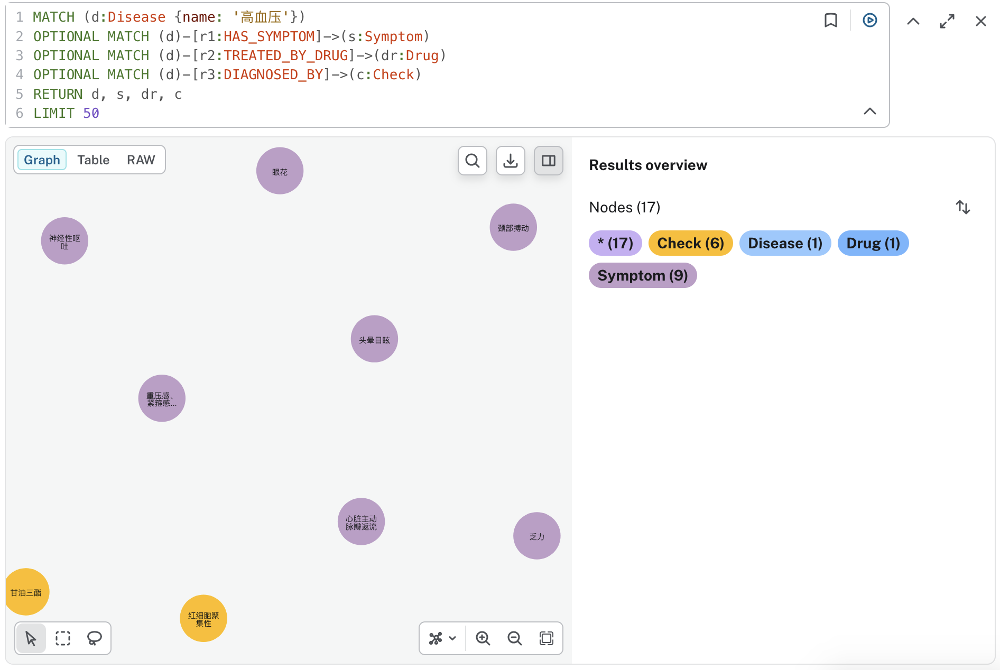
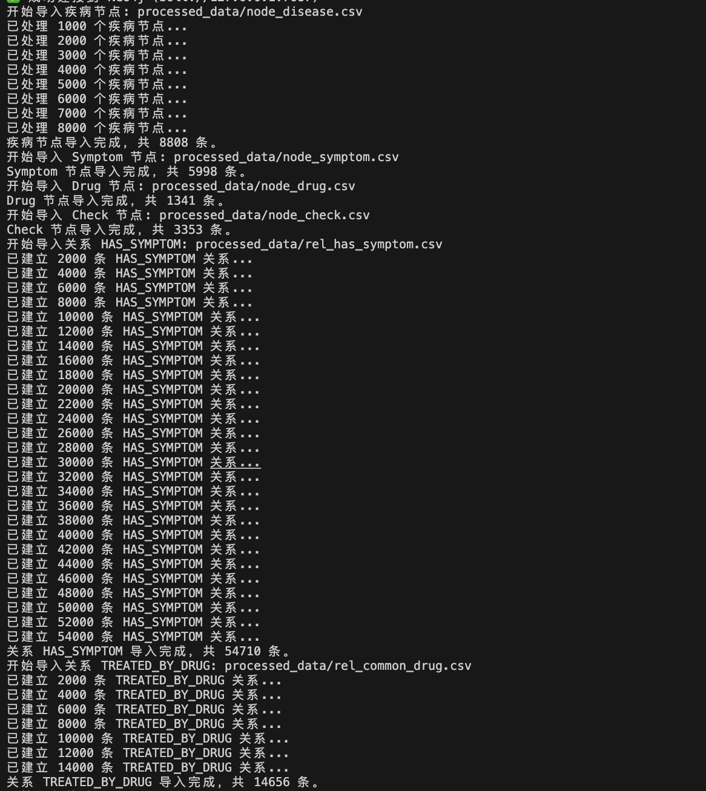
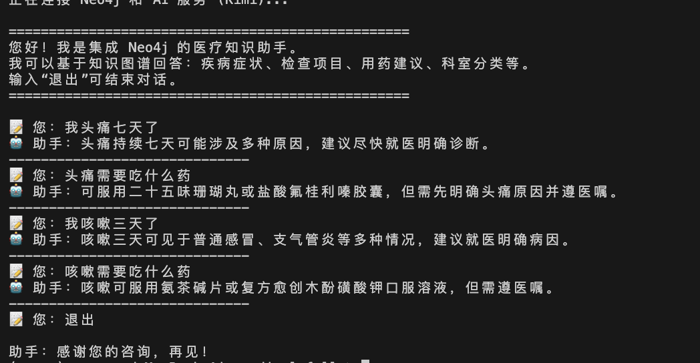
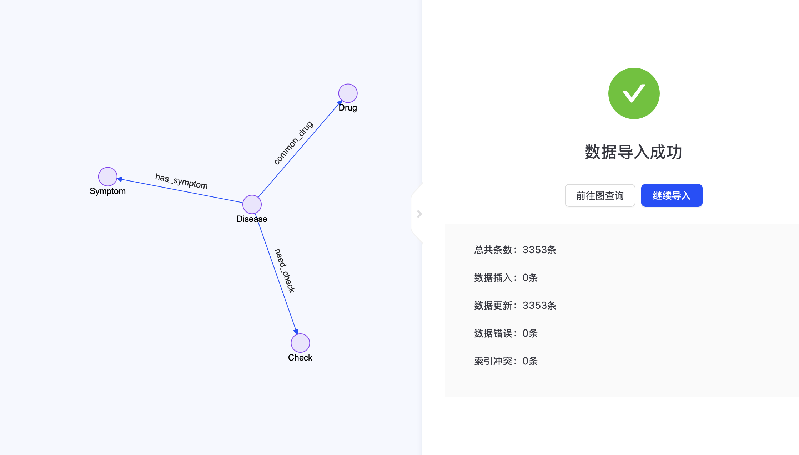
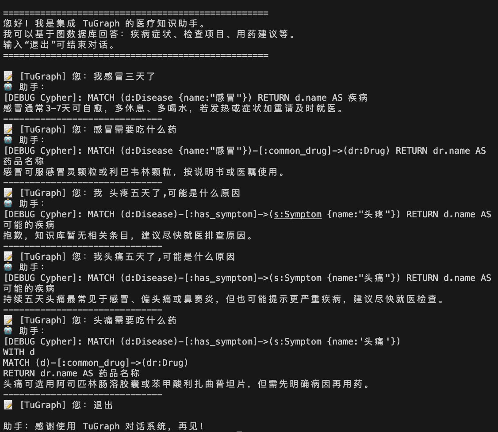

# Hw03 调用RAG 来构建医疗对话系统
仍然是基于Tugraph和Neo4j的知识图谱任务，数据来源为作业示例1中的QASystemOnMedicalGraph-master所参考的github仓库中的链接，需要利用词库先进行数据预处理
```python
import pandas as pd
import json
import os

def preprocess_medical_data(input_file, output_dir):
    print(f"开始预处理数据: {input_file}")
    
    diseases = []
    symptoms = set()
    drugs = set()
    checks = set()
    
    rel_disease_symptom = []
    rel_disease_drug = []
    rel_disease_check = []

    try:
        with open(input_file, 'r', encoding='utf-8') as f:
            for line in f:
                data = json.loads(line)
                disease_name = data.get('name')
                if not disease_name:
                    continue
                
                diseases.append({
                    'disease_id': disease_name, 
                    'name': disease_name,
                    'desc': data.get('desc', ''),
                    'prevent': data.get('prevent', ''),
                    'cause': data.get('cause', ''),
                    'easy_get': data.get('easy_get', ''),
                    'cure_lasttime': data.get('cure_lasttime', ''),
                    'cured_prob': data.get('cured_prob', ''),
                    'cost_money': data.get('cost_money', '')
                })

                for s in data.get('symptom', []):
                    symptoms.add(s)
                    rel_disease_symptom.append({'disease_id': disease_name, 'symptom_id': s})
                
                for d in data.get('common_drug', []):
                    drugs.add(d)
                    rel_disease_drug.append({'disease_id': disease_name, 'drug_id': d})
                
                for c in data.get('check', []):
                    checks.add(c)
                    rel_disease_check.append({'disease_id': disease_name, 'check_id': c})

    except Exception as e:
        print(f"文件读取失败: {e}")
        return

    if not os.path.exists(output_dir):
        os.makedirs(output_dir)

    pd.DataFrame(diseases).to_csv(f"{output_dir}/node_disease.csv", index=False, encoding='utf-8-sig')
    pd.DataFrame([{'name': s} for s in symptoms]).to_csv(f"{output_dir}/node_symptom.csv", index=False, encoding='utf-8-sig')
    pd.DataFrame([{'name': d} for d in drugs]).to_csv(f"{output_dir}/node_drug.csv", index=False, encoding='utf-8-sig')
    pd.DataFrame([{'name': c} for c in checks]).to_csv(f"{output_dir}/node_check.csv", index=False, encoding='utf-8-sig')

    pd.DataFrame(rel_disease_symptom).to_csv(f"{output_dir}/rel_has_symptom.csv", index=False, encoding='utf-8-sig')
    pd.DataFrame(rel_disease_drug).to_csv(f"{output_dir}/rel_common_drug.csv", index=False, encoding='utf-8-sig')
    pd.DataFrame(rel_disease_check).to_csv(f"{output_dir}/rel_need_check.csv", index=False, encoding='utf-8-sig')

    print(f"数据处理完成！输出目录: {output_dir}")
    print(f"疾病数量: {len(diseases)}")
    print(f"症状数量: {len(symptoms)}")
    print(f"药品数量: {len(drugs)}")
    print(f"检查项数量: {len(checks)}")

if __name__ == "__main__":
    current_dir = os.path.dirname(os.path.abspath(__file__))
    input_json = os.path.join(current_dir, "data", "medical.json")
    output_path = os.path.join(current_dir, "processed_data")
    
    preprocess_medical_data(input_json, output_path)

```
## 以Neo4j开始为例
先导入配置，规划好路径和文件
```python {config.py}
import os
from dotenv import load_dotenv

load_dotenv()

class Config:

    KIMI_API_KEY = os.getenv('KIMI_API_KEY', 'sk-U2KnkVDHpGGMKozQKmfpzlav2OQgiXBgIGRh3N6kWye75mKw')

    NEO4J_HOST = os.getenv('NEO4J_HOST', '127.0.0.1')
    NEO4J_PORT = int(os.getenv('NEO4J_PORT', '7474'))
    NEO4J_USER = os.getenv('NEO4J_USER', 'neo4j')
    NEO4J_PASSWORD = os.getenv('NEO4J_PASSWORD', 'neo4j123')

    TUGRAPH_HOST = os.getenv('TUGRAPH_HOST', '120.26.102.18')
    TUGRAPH_PORT = int(os.getenv('TUGRAPH_PORT', '7070'))
    TUGRAPH_USER = os.getenv('TUGRAPH_USER', 'admin')
    TUGRAPH_PASSWORD = os.getenv('TUGRAPH_PASSWORD', '!sMpAPDdS9p72DZZu')

current_config = Config()
```

构建链接Neo4j数据库

```python
import os
from py2neo import Graph
from config import current_config

class Neo4jConnector:
    def __init__(self, host=None, port=None, user=None, password=None):
        self.host = host or current_config.NEO4J_HOST
        self.port = port or current_config.NEO4J_PORT
        self.user = user or current_config.NEO4J_USER
        self.password = password or current_config.NEO4J_PASSWORD
        self.graph = None
        self._initialized = False
        self.connect()

    def connect(self):
        bolt_uri = f"bolt://{self.host}:7687"
        try:
            self.graph = Graph(bolt_uri, auth=(self.user, self.password))
            self.graph.run("RETURN 1").evaluate()
            self._initialized = True
            return True, f"已通过 Bolt 连接到 Neo4j ({bolt_uri})"
        except Exception as e_bolt:
            http_uri = f"http://{self.host}:{self.port}"
            try:
                self.graph = Graph(http_uri, auth=(self.user, self.password))
                self.graph.run("RETURN 1").evaluate()
                self._initialized = True
                return True, f"已通过 HTTP 连接到 Neo4j ({http_uri})"
            except Exception as e_http:
                self._initialized = False
                return False, f"Neo4j 连接失败: Bolt({e_bolt}), HTTP({e_http})"

    def test_connection(self):
        success, message = self.connect()
        return {"success": success, "message": message}

    def run(self, cypher, **parameters):
        if not self._initialized:
            success, msg = self.connect()
            if not success:
                raise ConnectionError(msg)
        return self.graph.run(cypher, **parameters)

    def data(self, cypher, **parameters):
        return self.run(cypher, **parameters).data()
```
在构建链接之后，即可上传数据，并且使用数据进行对话，完成问答系统
```python

import os
import pandas as pd
from py2neo import Node, Relationship
from config import current_config
from neo4j_connector import Neo4jConnector

neo4j = Neo4jConnector()
test_res = neo4j.test_connection()
if not test_res['success']:
    print(test_res['message'])
    exit(1)
else:
    print(test_res['message'])

graph = neo4j.graph

def import_diseases(csv_path):
    df = pd.read_csv(csv_path)
    count = 0
    for _, row in df.iterrows():
        props = {
            'name': row['name'],
            'desc': str(row.get('desc', '')),
            'prevent': str(row.get('prevent', '')),
            'cause': str(row.get('cause', '')),
            'easy_get': str(row.get('easy_get', '')),
            'cure_lasttime': str(row.get('cure_lasttime', '')),
            'cured_prob': str(row.get('cured_prob', '')),
            'cost_money': str(row.get('cost_money', ''))
        }
        node = Node('Disease', **props)
        graph.merge(node, 'Disease', 'name')
        count += 1
        if count % 1000 == 0:
            print(f"已处理 {count} 个疾病节点...")
    

def import_related_nodes(csv_path, label):
    print(f"开始导入 {label} 节点: {csv_path}")
    df = pd.read_csv(csv_path)
    id_col = df.columns[0]
    count = 0
    for _, row in df.iterrows():
        name = str(row[id_col]).strip()
        if name:
            node = Node(label, name=name)
            graph.merge(node, label, 'name')
            count += 1
    print(f"{label} 节点导入完成，共 {count} 条。")

def import_relationships(csv_path, rel_type, start_label, end_label):
    print(f"开始导入关系 {rel_type}: {csv_path}")
    df = pd.read_csv(csv_path)
    start_col = 'disease_id'
    end_col = df.columns[1]
    
    count = 0
    for _, row in df.iterrows():
        start_node = graph.nodes.match(start_label, name=row[start_col]).first()
        end_node = graph.nodes.match(end_label, name=row[end_col]).first()
        
        if start_node and end_node:
            rel = Relationship(start_node, rel_type, end_node)
            graph.merge(rel)
            count += 1
            if count % 2000 == 0:
                print(f"已建立 {count} 条 {rel_type} 关系...")
    print(f"关系 {rel_type} 导入完成，共 {count} 条。")

if __name__ == "__main__":
    DATA_DIR = "processed_data"
    
    import_diseases(os.path.join(DATA_DIR, "node_disease.csv"))
    
    import_related_nodes(os.path.join(DATA_DIR, "node_symptom.csv"), "Symptom")
    import_related_nodes(os.path.join(DATA_DIR, "node_drug.csv"), "Drug")
    import_related_nodes(os.path.join(DATA_DIR, "node_check.csv"), "Check")
    
    import_relationships(os.path.join(DATA_DIR, "rel_has_symptom.csv"), "HAS_SYMPTOM", "Disease", "Symptom")
    import_relationships(os.path.join(DATA_DIR, "rel_common_drug.csv"), "TREATED_BY_DRUG", "Disease", "Drug")
    import_relationships(os.path.join(DATA_DIR, "rel_need_check.csv"), "DIAGNOSED_BY", "Disease", "Check")
    
    for label in ["Disease", "Symptom", "Drug", "Check"]:
        count = graph.run(f"MATCH (n:{label}) RETURN count(n) as c").evaluate()
        print(f"节点 {label}: {count}")
    
    for rel in ["HAS_SYMPTOM", "TREATED_BY_DRUG", "DIAGNOSED_BY"]:
        count = graph.run(f"MATCH ()-[r:{rel}]->() RETURN count(r) as c").evaluate()
        print(f"关系 {rel}: {count}")
    print("="*30)
```
在导入数据之后，我们就创建链接，解析CYPHER,结合LLM实现LangChain
```python
import os
import re
import json
from neo4j_connector import Neo4jConnector
from langchain_openai import ChatOpenAI
from langchain_core.prompts import ChatPromptTemplate
from langchain_core.output_parsers import StrOutputParser
from config import current_config

print("正在连接 Neo4j 和 AI 服务 (Kimi)...")

llm = ChatOpenAI(
    model="kimi-k2-turbo-preview",
    openai_api_key=current_config.KIMI_API_KEY,
    openai_api_base="https://api.moonshot.cn/v1",
    temperature=0
)

neo4j = Neo4jConnector()
test_res = neo4j.test_connection()
if not test_res['success']:
    print(f"⚠️ {test_res['message']}")
else:
    print(f"{test_res['message']}")

cypher_prompt = ChatPromptTemplate.from_messages([
    ("system", """你是一名 Neo4j Cypher 专家。
知识图谱Schema:
- 节点：Disease、Symptom、Drug、Check、Treatment，属性只有 name:str
- 关系：
  (d:Disease)-[:HAS_SYMPTOM]->(s:Symptom)
  (d:Disease)-[:TREATED_BY_DRUG]->(dr:Drug)
  (d:Disease)-[:DIAGNOSED_BY]->(c:Check)
  (d:Disease)-[:TREATED_BY]->(t:Treatment)

用户问题会被转化为一条 Cypher 查询，要求：
1. 仅返回必要的节点或属性，不要返回整个路径
2. 不得修改/删除数据
3. 用中文别名返回时，请用 name 属性
4. 只输出一条可执行的 Cypher 语句，不要解释，不要 Markdown 代码块"""),
    ("human", "{question}")
])
cypher_chain = cypher_prompt | llm | StrOutputParser()

def _exec_cypher(cypher: str) -> str:
    try:
        if re.search(r"\b(delete|remove|set|merge|create|drop)\b", cypher, flags=re.I):
            return "验证失败：查询语句包含写操作，已拦截。"

        data = neo4j.data(cypher)
        if not data:
            return "知识库中目前没有找到相关具体条目。"
        
        lines = []
        for d in data:
            line_parts = []
            for k, v in d.items():
                val = v.get('name') if hasattr(v, 'get') and 'name' in v else v
                line_parts.append(f"{k}：{val}")
            lines.append("；".join(line_parts))
        
        return "。".join(lines) + "。"
    except Exception as e:
        return f"数据库查询过程中出现问题：{str(e)}"

answer_prompt = ChatPromptTemplate.from_messages([
    ("system", "你是友善的医疗知识助手。请根据查询结果用一句话回答用户问题，尽量简洁。若结果为空，请礼貌说明。"),
    ("human", "用户问题：{question}\n查询结果：{result}")
])
answer_chain = answer_prompt | llm | StrOutputParser()

def chat(question: str) -> str:
    try:
        cypher = cypher_chain.invoke({"question": question})
        cypher = cypher.strip().strip("`").strip(";")  # 移除可能的 markdown 标记和分号
        
        result = _exec_cypher(cypher)
        
        return answer_chain.invoke({"question": question, "result": result})
    except Exception as e:
        return f"抱歉，我处理这个问题时遇到了点麻烦：{str(e)}"

if __name__ == "__main__":
    print("\n" + "="*50)
    print("您好！我是集成 Neo4j 的医疗知识助手。")
    print("我可以基于知识图谱回答：疾病症状、检查项目、用药建议、科室分类等。")
    print("输入“退出”可结束对话。")
    print("="*50 + "\n")
    
    while True:
        try:
            q = input("📝 您：").strip()
            if not q:
                continue
            lower_text = q.lower()
            if any(k in lower_text for k in {"退出", "exit", "quit", "算了"}):
                print("\n助手：感谢您的咨询，再见！")
                break
                
            print("🤖 助手：", end="", flush=True)
            res = chat(q)
            print(res)
            print("-" * 30)
        except KeyboardInterrupt:
            print("\n对话已终止。")
            break
        except Exception as e:
            print(f"\n运行时错误: {e}")
```
下面展示上面会出现的运行时图片




## TuGraph的演示
由于数据已经加载好了，所以这里不用再次重复一边了
```python
#!/usr/bin/env python3
# coding: utf-8
import os
import pandas as pd
from py2neo import Node, Relationship, Graph
from config import current_config

class TuGraphConnector:
    
    def __init__(self):

        self.host = current_config.TUGRAPH_HOST  # 默认 localhost
        self.port = current_config.TUGRAPH_BOLT_PORT  # 默认 7687
        self.username = current_config.TUGRAPH_USERNAME  # 默认 admin
        self.password = current_config.TUGRAPH_PASSWORD  # 需要设置密码
        self.database = current_config.TUGRAPH_DATABASE  # 默认 default
        
        self.graph = None
        self._connect()
    
    def _connect(self):
        try:
            uri = f"bolt://{self.host}:{self.port}"
            self.graph = Graph(
                uri,
                auth=(self.username, self.password),
                name=self.database
            )
        except Exception as e:
            print(f"连接 TuGraph 失败: {e}")
            raise
    
    def test_connection(self):
        try:
            result = self.graph.run("RETURN 1 as test").evaluate()
            if result == 1:
                return {
                    'success': True,
                    'message': f'TuGraph 连接成功! (bolt://{self.host}:{self.port}/{self.database})'
                }
        except Exception as e:
            return {
                'success': False,
                'message': f'TuGraph 连接失败: {str(e)}'
            }
tugraph = TuGraphConnector()
test_res = tugraph.test_connection()
if not test_res['success']:
    print(test_res['message'])
    exit(1)
else:
    print(test_res['message'])

graph = tugraph.graph

def create_schema():
    try:
        graph.run("CREATE INDEX ON :Disease(name) IF NOT EXISTS")
        graph.run("CREATE INDEX ON :Symptom(name) IF NOT EXISTS")
        graph.run("CREATE INDEX ON :Drug(name) IF NOT EXISTS")
        graph.run("CREATE INDEX ON :Check(name) IF NOT EXISTS")
        print("Schema 创建完成")
    except Exception as e:
        print(f"Schema 创建警告: {e}")
        print("继续执行数据导入...")

def import_diseases(csv_path):
    df = pd.read_csv(csv_path)
    count = 0
    
    batch_size = 500
    nodes_batch = []
    
    for _, row in df.iterrows():
        props = {
            'name': str(row['name']).strip(),
            'desc': str(row.get('desc', '')),
            'prevent': str(row.get('prevent', '')),
            'cause': str(row.get('cause', '')),
            'easy_get': str(row.get('easy_get', '')),
            'cure_lasttime': str(row.get('cure_lasttime', '')),
            'cured_prob': str(row.get('cured_prob', '')),
            'cost_money': str(row.get('cost_money', ''))
        }
        
        node = Node('Disease', **props)
        nodes_batch.append(node)
        count += 1
        
        if len(nodes_batch) >= batch_size:
            tx = graph.begin()
            for n in nodes_batch:
                tx.merge(n, 'Disease', 'name')
            tx.commit()
            nodes_batch = []
            print(f"已处理 {count} 个疾病节点...")

    if nodes_batch:
        tx = graph.begin()
        for n in nodes_batch:
            tx.merge(n, 'Disease', 'name')
        tx.commit()
    
    print(f"疾病节点导入完成，共 {count} 条。")

def import_related_nodes(csv_path, label):
    df = pd.read_csv(csv_path)
    id_col = df.columns[0]
    count = 0
    
    batch_size = 1000
    nodes_batch = []
    
    for _, row in df.iterrows():
        name = str(row[id_col]).strip()
        if name:
            node = Node(label, name=name)
            nodes_batch.append(node)
            count += 1
            
            if len(nodes_batch) >= batch_size:
                tx = graph.begin()
                for n in nodes_batch:
                    tx.merge(n, label, 'name')
                tx.commit()
                nodes_batch = []

    if nodes_batch:
        tx = graph.begin()
        for n in nodes_batch:
            tx.merge(n, label, 'name')
        tx.commit()
    
    print(f"{label} 节点导入完成，共 {count} 条。")

def import_relationships(csv_path, rel_type, start_label, end_label):
    
    df = pd.read_csv(csv_path)
    start_col = 'disease_id'
    end_col = df.columns[1]
    
    count = 0
    batch_size = 500
    
    batch_data = []
    
    for _, row in df.iterrows():
        batch_data.append({
            'start_name': str(row[start_col]).strip(),
            'end_name': str(row[end_col]).strip()
        })
        
        if len(batch_data) >= batch_size:
            query = f"""
            UNWIND $batch as item
            MATCH (start:{start_label} {{name: item.start_name}})
            MATCH (end:{end_label} {{name: item.end_name}})
            MERGE (start)-[r:{rel_type}]->(end)
            """
            graph.run(query, batch=batch_data)
            count += len(batch_data)
            batch_data = []
            print(f"已建立 {count} 条 {rel_type} 关系...")
    
    if batch_data:
        query = f"""
        UNWIND $batch as item
        MATCH (start:{start_label} {{name: item.start_name}})
        MATCH (end:{end_label} {{name: item.end_name}})
        MERGE (start)-[r:{rel_type}]->(end)
        """
        graph.run(query, batch=batch_data)
        count += len(batch_data)
    
    print(f"关系 {rel_type} 导入完成，共 {count} 条。")

def print_statistics():
    
    for label in ["Disease", "Symptom", "Drug", "Check"]:
        try:
            count = graph.run(f"MATCH (n:{label}) RETURN count(n) as c").evaluate()
            print(f"  {label:12s}: {count:>6,} 个")
        except Exception as e:
            print(f"  {label:12s}: 查询失败 ({e})")
    
    for rel in ["HAS_SYMPTOM", "TREATED_BY_DRUG", "DIAGNOSED_BY"]:
        try:
            count = graph.run(f"MATCH ()-[r:{rel}]->() RETURN count(r) as c").evaluate()
            print(f"  {rel:18s}: {count:>6,} 条")
        except Exception as e:
            print(f"  {rel:18s}: 查询失败 ({e})")
    
    try:
        total_nodes = graph.run("MATCH (n) RETURN count(n) as c").evaluate()
        total_rels = graph.run("MATCH ()-[r]->() RETURN count(r) as c").evaluate()
        print(f"  总节点数: {total_nodes:>6,}")
        print(f"  总关系数: {total_rels:>6,}")
    except Exception as e:
        print(f"  统计失败: {e}")
    
    print("="*50)

if __name__ == "__main__":
    DATA_DIR = "processed_data"
    
    try:
        create_schema()
        
        print("\n步骤 1/4: 导入疾病节点")
        import_diseases(os.path.join(DATA_DIR, "node_disease.csv"))
        
        print("\n步骤 2/4: 导入辅助节点")
        import_related_nodes(os.path.join(DATA_DIR, "node_symptom.csv"), "Symptom")
        import_related_nodes(os.path.join(DATA_DIR, "node_drug.csv"), "Drug")
        import_related_nodes(os.path.join(DATA_DIR, "node_check.csv"), "Check")
        
        print("\n步骤 3/4: 导入关系")
        import_relationships(os.path.join(DATA_DIR, "rel_has_symptom.csv"), "HAS_SYMPTOM", "Disease", "Symptom")
        import_relationships(os.path.join(DATA_DIR, "rel_common_drug.csv"), "TREATED_BY_DRUG", "Disease", "Drug")
        import_relationships(os.path.join(DATA_DIR, "rel_need_check.csv"), "DIAGNOSED_BY", "Disease", "Check")
        
        print("\n步骤 4/4: 统计结果")
        print_statistics()
        
        print("\n✅ 所有数据导入完成!")
        
    except Exception as e:
        print(f"\n导入过程中出现错误: {e}")
        import traceback
        traceback.print_exc()
```
```python
import json
import requests
import os
from typing import Optional, Dict, Any
from dotenv import load_dotenv

load_dotenv()

class TuGraphConnector:

    def __init__(
        self,
        host: str = None,
        port: int = None,
        user: str = None,
        password: str = None,
        graph_name: str = 'medical'
    ):
       
        self.host = host or os.getenv('TUGRAPH_HOST', '127.0.0.1')
        self.port = port or int(os.getenv('TUGRAPH_PORT', '7070'))
        self.user = user or os.getenv('TUGRAPH_USER', 'admin')
        self.password = password or os.getenv('TUGRAPH_PASSWORD', 'lhy123')
        self.graph_name = graph_name

        self.base_url = f"http://{self.host}:{self.port}"
        self.token = None
        self._initialized = False

    def login(self) -> Dict[str, Any]:

        try:
            url = f"{self.base_url}/login"
            payload = {
                'user': self.user,
                'password': self.password
            }

            response = requests.post(url, json=payload, timeout=10)

            if response.status_code == 200:
                result = response.json()
                if 'jwt' in result:
                    self.token = result['jwt']
                    self._initialized = True
                    return {
                        'success': True,
                        'token': self.token
                    }
                else:
                    return {
                        'success': False,
                        'error': '登录响应中没有token'
                    }
            else:
                return {
                    'success': False,
                    'error': f'登录失败: HTTP {response.status_code}'
                }

        except requests.exceptions.ConnectionError:
            return {
                'success': False,
                'error': f'无法连接到TuGraph服务器 {self.host}:{self.port}'
            }
        except Exception as e:
            return {
                'success': False,
                'error': f'登录异常: {str(e)}'
            }

    def execute_cypher(self, cypher: str, params: dict = None) -> Dict[str, Any]:
    
        if not self._initialized:
            login_result = self.login()
            if not login_result['success']:
                return login_result

        try:
            url = f"{self.base_url}/cypher"
            headers = {
                'Authorization': f'Bearer {self.token}',
                'Content-Type': 'application/json'
            }
            payload = {
                'graph': self.graph_name,
                'script': cypher
            }
            if params:
                payload['parameters'] = params

            response = requests.post(url, headers=headers, json=payload, timeout=30)

            if response.status_code == 200:
                result = response.json()
                if 'result' in result:
                    return {
                        'success': True,
                        'data': result['result']
                    }
                else:
                    return {
                        'success': True,
                        'data': result
                    }
            elif response.status_code == 401:
                self._initialized = False
                login_result = self.login()
                if login_result['success']:
                    return self.execute_cypher(cypher, params)
                return login_result
            else:
                error_msg = response.text or f'HTTP {response.status_code}'
                return {
                    'success': False,
                    'error': f'查询失败: {error_msg}'
                }

        except requests.exceptions.Timeout:
            return {
                'success': False,
                'error': '查询超时'
            }
        except Exception as e:
            return {
                'success': False,
                'error': f'查询异常: {str(e)}'
            }

    def test_connection(self) -> Dict[str, Any]:
        try:
            login_result = self.login()
            if not login_result['success']:
                return login_result

            test_result = self.execute_cypher("MATCH (n) RETURN count(n) as count LIMIT 1")
            if test_result['success']:
                return {
                    'success': True,
                    'message': f'TuGraph连接成功 ({self.host}:{self.port})',
                    'graph': self.graph_name
                }
            return test_result

        except Exception as e:
            return {
                'success': False,
                'error': f'连接测试失败: {str(e)}'
            }

    def get_schema(self) -> Dict[str, Any]:
        try:
            # TuGraph获取schema的API
            result = self.execute_cypher("CALL db.vertexLabels()")
            if result['success']:
                vertex_labels = result['data']

                edge_result = self.execute_cypher("CALL db.edgeLabels()")
                edge_labels = edge_result.get('data', []) if edge_result['success'] else []

                return {
                    'success': True,
                    'vertex_labels': vertex_labels,
                    'edge_labels': edge_labels
                }
            return result

        except Exception as e:
            return {
                'success': False,
                'error': f'获取Schema失败: {str(e)}'
            }


class TuGraphConnectorMock:
    def __init__(self, *args, **kwargs):
        self._initialized = True
        print("使用TuGraph模拟连接器")

    def login(self) -> Dict[str, Any]:
        return {'success': True, 'token': 'mock_token'}

    def execute_cypher(self, cypher: str, params: dict = None) -> Dict[str, Any]:
        if 'Disease' in cypher:
            return {
                'success': True,
                'data': [
                    {'name': '感冒', 'desc': '普通感冒是一种常见的上呼吸道感染'},
                    {'name': '肺炎', 'desc': '肺炎是一种常见的下呼吸道感染'},
                    {'name': '糖尿病', 'desc': '糖尿病是一种慢性代谢性疾病'}
                ]
            }
        elif 'Symptom' in cypher:
            return {
                'success': True,
                'data': [
                    {'name': '发热'},
                    {'name': '咳嗽'},
                    {'name': '头痛'}
                ]
            }
        else:
            return {
                'success': True,
                'data': [{'count': 100}]
            }

    def test_connection(self) -> Dict[str, Any]:
        return {
            'success': True,
            'message': 'TuGraph模拟连接器运行正常',
            'graph': 'medical_mock'
        }

    def get_schema(self) -> Dict[str, Any]:
        return {
            'success': True,
            'vertex_labels': ['Disease', 'Symptom', 'Drug', 'Food', 'Check'],
            'edge_labels': ['has_symptom', 'common_drug', 'do_eat']
        }


if __name__ == '__main__':
    connector = TuGraphConnector()
    result = connector.test_connection()
    print(json.dumps(result, ensure_ascii=False, indent=2))
```
下面连接TuGraph数据库,解析Cypher语句，进行问答对话
```python
=
import os
import re
import json
from tugraph_connector import TuGraphConnector
from langchain_openai import ChatOpenAI
from langchain_core.prompts import ChatPromptTemplate
from langchain_core.output_parsers import StrOutputParser
from config import current_config
=
print("正在连接 TuGraph 和 AI 服务 (Kimi)...")

llm = ChatOpenAI(
    model="kimi-k2-turbo-preview",
    openai_api_key=current_config.KIMI_API_KEY,
    openai_api_base="https://api.moonshot.cn/v1",
    temperature=0
)

tugraph = TuGraphConnector(
    host=current_config.TUGRAPH_HOST,
    port=current_config.TUGRAPH_PORT,
    user=current_config.TUGRAPH_USER,
    password=current_config.TUGRAPH_PASSWORD,
    graph_name='medical'  # 默认使用 medical 图谱
)

test_res = tugraph.test_connection()
if not test_res['success']:
    print(f"⚠️ TuGraph 连接警告: {test_res.get('error')}")
    print("将以降级模式继续运行...")
else:
    print(f"✅ {test_res['message']}")
=
cypher_prompt = ChatPromptTemplate.from_messages([
    ("system", """你是一名 TuGraph Cypher 专家。
知识图谱Schema:
- 节点：Disease、Symptom、Drug、Check，属性只有 name:str
- 关系：
  (d:Disease)-[:has_symptom]->(s:Symptom)
  (d:Disease)-[:common_drug]->(dr:Drug)
  (d:Disease)-[:need_check]->(c:Check)

用户问题会被转化为一条 Cypher 查询，要求：
1. 仅返回必要的节点或属性，不要返回整个路径。
2. 必须先从用户问题中提取核心医疗实体（如：把“我感冒三天了”提取为“感冒”）。
3. 如果不确定实体全名，可以使用 `WHERE n.name CONTAINS '关键词'`。
4. 不得修改/删除数据。
5. 只输出一条可执行的 Cypher 语句，不要解释，不要 Markdown 代码块。
注意：TuGraph 的关系名是小写的 (has_symptom, common_drug, need_check)。"""),
    ("human", "{question}")
])
cypher_chain = cypher_prompt | llm | StrOutputParser()

def _exec_cypher(cypher: str) -> str:
    try:
        if re.search(r"\b(delete|remove|set|merge|create|drop)\b", cypher, flags=re.I):
            return "验证失败：查询语句包含写操作，已拦截。"
        
        result = tugraph.execute_cypher(cypher.strip().strip(";"))
        
        if not result['success']:
            return f"图数据库查询失败: {result.get('error')}"
        
        data = result.get('data', [])
        if not data:
            return "知识库中目前没有找到相关具体条目。"
        
        lines = []
        for item in data:
            if isinstance(item, dict):
                lines.append("；".join(f"{k}：{v}" for k, v in item.items()))
            elif isinstance(item, list):
                lines.append("；".join([str(x) for x in item]))
            else:
                lines.append(str(item))
        
        return "。".join(lines) + "。"
    except Exception as e:
        return f"查询过程中出现问题：{str(e)}"

answer_prompt = ChatPromptTemplate.from_messages([
    ("system", "你是友善的医疗知识助手。请根据查询结果用一句话回答用户问题，尽量简洁。若结果为空，请礼貌说明。"),
    ("human", "用户问题：{question}\n查询结果：{result}")
])
answer_chain = answer_prompt | llm | StrOutputParser()

def chat(question: str) -> str:
    try:
        cypher = cypher_chain.invoke({"question": question})
        cypher = cypher.strip().strip("`").strip(";")
        
        print(f"\n[DEBUG Cypher]: {cypher}")
        
        result = _exec_cypher(cypher)
        
        return answer_chain.invoke({"question": question, "result": result})
    except Exception as e:
        return f"抱歉，我处理这个问题时遇到了点麻烦：{str(e)}"

if __name__ == "__main__":
    print("\n" + "="*50)
    print("您好！我是集成 TuGraph 的医疗知识助手。")
    print("我可以基于图数据库回答：疾病症状、检查项目、用药建议等。")
    print("输入“退出”可结束对话。")
    print("="*50 + "\n")
    
    while True:
        try:
            q = input("📝 [TuGraph] 您：").strip()
            if not q:
                continue
            lower_text = q.lower()
            if any(k in lower_text for k in {"退出", "exit", "quit"}):
                print("\n助手：感谢使用 TuGraph 对话系统，再见！")
                break
                
            print("🤖 助手：", end="", flush=True)
            res = chat(q)
            print(res)
            print("-" * 30)
        except KeyboardInterrupt:
            print("\n对话已终止。")
            break
        except Exception as e:
            print(f"\n运行时错误: {e}")
```
最终我们也可以得到一些图


